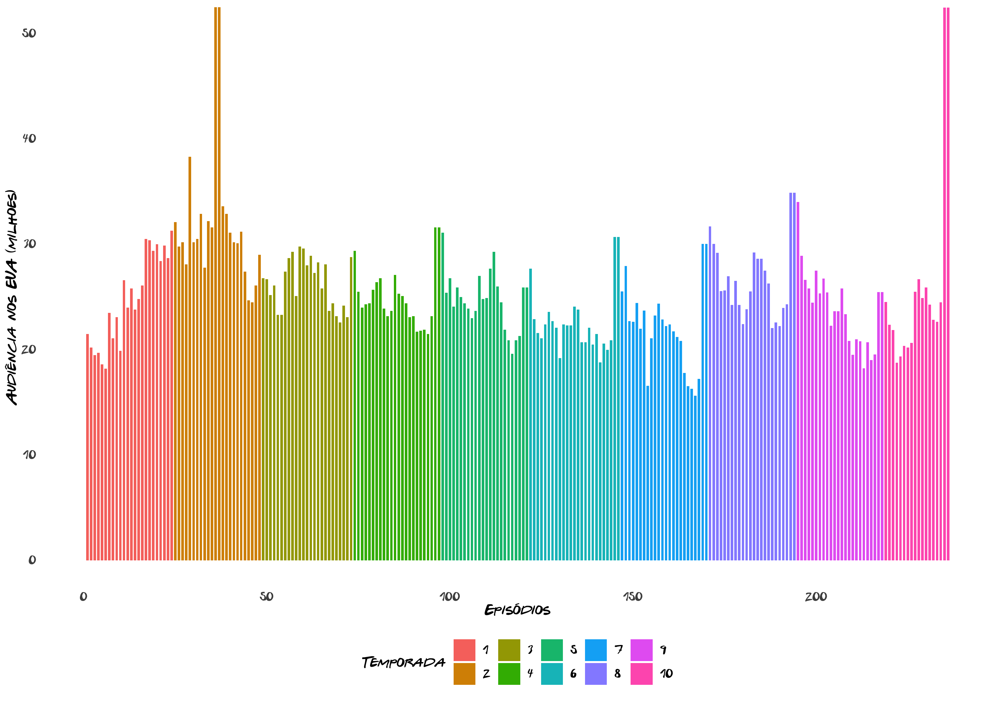
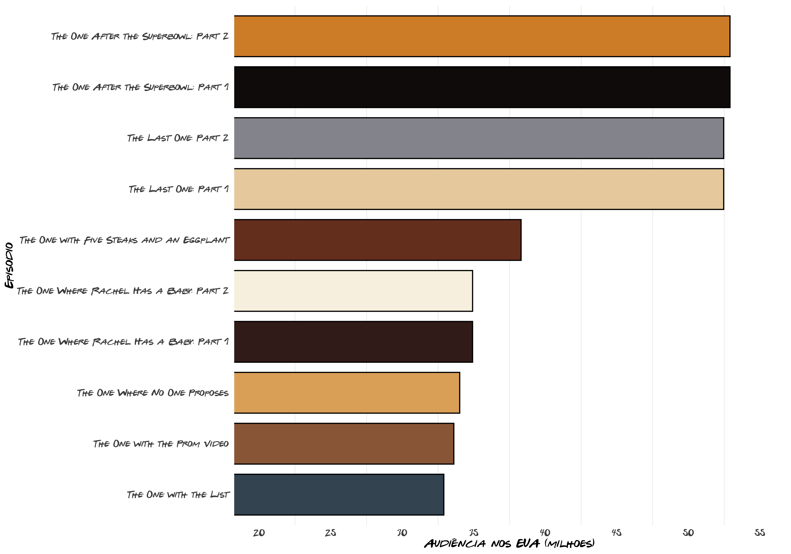
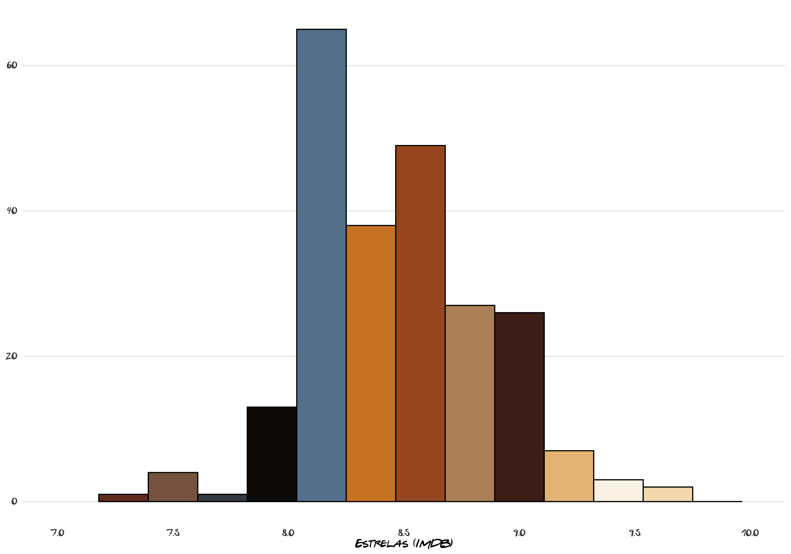

<!-- README.md is generated from README.Rmd. Please edit that file -->

# Aquele com a análise de dados de

**FRIENDS** é um dos meus seriados fevoritos (*provavelmente* o
favorito) e tenho certeza que não sou a única que assisti mais de uma,
duas, três…vezes. Ela foi criada por David Crane e Marta Kauffman e foi
apresentada pela rede de televisão americana NBC entre 22 de setembro de
1994 e 6 de maio de 2004, com um total de 236 episódios. A série girava
em torno da vida de um grupo de seis amigos que viviam em Nova York
City: Chandler Bing, Joey Tribbiani, Mônica Geller, Phoebe Buffay,
Rachel Green e Ross Geller. As filmagens ocorriam no Warner Bros
Studios, em Burbank, na Califórnia, em frente a uma plateia ao vivo.
Dentre os vários prêmios recebidos pela série estão: seis Prêmios Emmy,
um Globo de Ouro, dois SAG Awards e 56 outros prêmios com 152 nomeações.
Em 2002, a *TV Guide*, revista especializada em televisão, divulgou uma
lista com os 50 melhores programas de televisão de todos os tempos, e
**FRIENDS** estava em 21º lugar. O programa já foi transmitido para
dezenas de países e as reprises de seus episódios continuam com boas
audiências.

Neste breve trabalho temos o objetivo de analisar os índices de
audiência do seriado ao longo de seus 10 anos de exibição, assim como
as temporadas e episódios avaliados segundo a base do IMDb. Para essa
análise, serão utilizados os dados colhidos da base IMDb e os gráficos
criados através da Linguagem R.

# Audiência:

Sucesso absoluto na metade final dos anos 1990 e início dos anos 2000, e
com uma legião de fãs até os dias atuais, **FRIENDS** estreou no dia 22
de setembro de 1994 e atraiu 21,5 milhões de espectadores. Ao longo de
seus 10 anos de exibição no horário nobre da TV americana, manteve uma
audiência média de 25,4 milhões de telespectadores por episódio, se
classificando consistentemente entre as 10 séries mais assistidas na
televisão americana.

O gráfico a seguir demonstra a audiência (em milhões de espectadores)
para cada episódio da série. É possível observar que 4 episódios se
destacam bastante, eles serão apresentados mais detalhadamente no
próximo gráfico.

O gráfico abaixo apresenta os 10 episódios com maior número de
telespectadores nos EUA (em milhões). Entre estes, 4 episódios se
destacam com uma audiência acima dos 50 milhões: **“The One After the
Superbowl”** e **“The Last One”**, ambos divididos em duas partes e,
portanto, são contabilizados como 4 episódios. Menção para **“The One
Where Rachel Has a Baby”**, season finale da 8ª temporada, com 34,91
milhões de telespectadores, e **“The One Where No One Proposes”**,
season premiere da 9ª temporada, com 34,01 milhões de telespectadores.

 **“The One After the
Superbowl”**, traduzido como “Aquele Depois do Superbowl”, foi exibido
logo após o *‘Superbowl XXX’* no dia 28 de janeiro de 1996. É o episódio
mais assistido da série, com 52,9 milhões de espectadores. Escrito por
Jeffrey Astrof, Mike Sikowitz e Michael Borkow, mostra o reencontro
entre Ross e Marcel (seu macaco de estimação que se tornou um astro de
Hollywood), o encontro nada bem-sucedido entre Chandler e uma antiga
colega de classe; a relação entre Joey e uma fã atraente (mas
mentalmente instável), Phoebe é convidada a cantar para crianças em uma
biblioteca e, por fim, a competição entre Rachel e Monica para conseguir
a atenção de Jean-Claude Van Damme. Por ser um episódio especial, contou
com a presença de astros do cinema americano como Julia Roberts, Brooke
Shields, Dan Castellaneta, Chris Isaak e Jean Claude Van-Damme.

**“The Last One”**, traduzido para o português como “O último”, é, como
o nome já diz, o último episódio da série. Exibido no dia 06 de maio de
2004, **“The Last One”** foi escrito pelos próprios criadores da série,
David Crane e Marta Kauffman, e mostra o nascimento do bebê que Mônica e
Chandler irão adotar (mas são surpreendidos com um casal de gêmeos) e a
preparação do casal na mudança para os arredores de Manhattan, Ross e
Rachel (*finalmente\!*) ficam juntos após ele correr atrás dela no
aeroporto e dizer que a ama. Phoebe continua casada com Mike, e Joey se
prepara para tentar a carreira de ator em Los Angeles. O capítulo final
foi assistido por mais de 52 milhões de telespectadores, tornando-se a
transmissão mais vista nos últimos seis anos, e o quarto final de série
mais assistido na história da televisão, atrás de ’M*A*S\*H’, ‘Cheers’ e
‘Seindfeld’.

# Estrelas IMDb

IMDb, também conhecida como *Internet Movie Database*, é uma base de
dados online de informação sobre música, cinema, filmes, programas e
comerciais para televisão. Além disso, é a maior plataforma de avaliação
de filmes e séries de TV do mundo. A avaliação ocorre de maneira
relativamente simples: os espectadores cadastrados dão notas de 0 a 10 e
disso é extraído uma média (há, também, a nota dos críticos).

Entre todos os programas de TV avaliados pelo site, \*FRIENDS\*\* ocupa
a 43ª posição com 8.8 estrelas O IMDb, segundo seus usuários, avaliou a
10ª e a 5ª temporada, respectivamente, como a melhor e segunda melhor
entre as 10 temporadas da série. Enquanto a 9ª e a 1ª foram
classificados como a pior e a segunda pior, nessa ordem. O gráfico
abaixo apresenta a avaliação média para todas as temporadas.

 A temporada que recebeu
melhor avaliação (10ª e última da série) obteve uma média de 8.68
estrelas. Ela estreou em 2 de outubro de 2003 com o episódio **“The One
After Joey and Rachel Kiss”** e, após 18 episódios, foi concluída com
**“The Last One”** no dia 6 de maio de 2004. Nela, assistimos os
desfechos dos seis personagens que acompanhamos ao longo dos últimos 10
anos. Após negar na primeira vez, Phoebe aceita se casar com Mike.
Chandler e Monica decidem aumentar a família e se mudar para os
arredores de Nova York. Depois de diversas tentativas de engravidar,
eles decidem adorar o bebê de uma mulher que está grávida, mas que não
poderia criar a criança. No parto, descobrem que é um casal de gêmeos.
Rachel consegue o emprego “dos sonhos” em Paris. Ross descobre que ainda
ama Rachel e decide correr atrás dela no aeroporto, mas ela já havia
embarcado. Na volta para seu apartamento, Ross escuta a mensagem dela na
secretária eletrônica, dizendo que ela ainda o ama e que está tentando
descer do avião. Ao fim da mensagem, Rachel aparece na porta e os dois
(finalmente) se beijam. Joey decide tentar a vida de ator em Hollywood e
se muda para Las Vegas.

A 5ª temporada da série obteve uma média de 8.64 estrelas, ficando com a
segunda melhor avaliação. Ela estreou no dia 24 de setembro de 1998 com
o episódio **“The One After Ross Says Rachel”** e, 24 episódios depois,
foi concluída com **“The One in Vegas”** em 20 de maio de 1999. Nesta
temporada, Mônica e Chandler tentam manter seu relacionamento em segredo
dos outros amigos. O centésimo episódio da série é marcado pelo
nascimento dos trigêmeos de Phoebe. O casamento de Ross e Emily é
cancelado por Emily, que se sente ameaçada por Rachel, uma vez que o
noivo disse o nome errado no altar. Mônica e Chandler decidem tornar seu
relacionamento público para os amigos e decidem se casar em uma viagem
para Las Vegas, mas desistem depois de encontrarem Ross e Rachel,
bêbados, recém-casados na mesma capela.

 O gráfico acima realça os 10
episódios - dentre o universo de 236 - com melhor avaliação segundo o
IMDb, todos com mais de 9.2 estrelas. O destaque maior estão nos títulos
**“The One Where Everybody Finds Out”** e **“The Last One: Part 2”**,
ambas com 9.7 estrelas.

**“The One Where Everybody Finds Out”** (em português: “Aquele em que
Todos Descobrem”), é o 14º episódio da 5ª temporada e foi exibido no dia
11 de fevereiro de 1999. Nele, Phoebe descobre o romance de Monica e
Chandler e, com a ajuda de Rachel e Joey, decidem fazer com que eles
assumam a relação; enquanto isso, Ross negocia o apartamento do ‘Ugly
Naked Guy’ que está para alugar.

O histograma abaixo revela a frequência das estrelas dadas pelos
usuários do IMDb. Há uma predominância na quantidade de estrelas entre
8.0 e 9.0. A maioria das notas abaixo de 8.0 foram dadas para episódios
que continham, basicamente, *flasbacks* de episódios passados. Por outro
lado, a predominância de episódios com notas acima de 9.0 está
relacionada a episódios especiais de *Thanksgiving* (o dia de Ação de
Graças americado) ou com eventos importante para a dupla ‘Ross &
Rachel’. O casal que têm sua história de amor iniciada ainda na
primeira temporada, quando Ross se mostrava apaixonado por Rachel. Entre
idas e vindas, tornaram-se o casal principal da série (até o
relacionamento entre Chandler e Mônica) e, durante os 10 anos, chegaram
a se casar em Las Vegas, se divorciaram logo em seguida e também tiveram
uma filha, mesmo permanecendo separados.

# Conclusão:

**FRIENDS** é um seriado de 26 anos de idade, que terminou há mais de
15. Mesmo depois de tanto tempo, a série permanece com um público
(antigo e recente) fiel às suas origens. Ainda hoje, no Brasil e em
vários outros países, a história dos seis amigos de NYC é uma das mais
assistidas pelo serviço de *streaming* da Netflix. Nos Estados Unidos,
somente em 2019, **FRIENDS** foi destronada do topo de popularidade por
“The Office”.

# Refêrencias:

[FRIENDS Central](https://friends.fandom.com/wiki/Friends_Wiki)

[FRIENDS (TV Series 1994-2004)](https://www.imdb.com/title/tt0108778/)

[FRIENDS Nielsen Ratings
Archive](http://newmusicandmore.tripod.com/friendsratings.html)

[TOP 10: Os 10 episódios mais engraçados de
FRIENDS](https://comentaseries.wordpress.com/2009/07/20/top-10-os-10-episodios-mais-engracados-de-friends/)

[UOL Notícias - Último episódio de FRIENDS teve 51 milhões de
espectadores](https://noticias.uol.com.br/ultnot/2004/05/07/ult1817u1023.jhtm)

[UOL Entretenimento - The Office ultrapassa Friends como a série mais
vista da Netflix nos
EUA](https://entretenimento.uol.com.br/noticias/redacao/2019/10/29/the-office-ultrapassa-friends-como-a-serie-mais-vista-da-netflix-nos-eua.htm)
